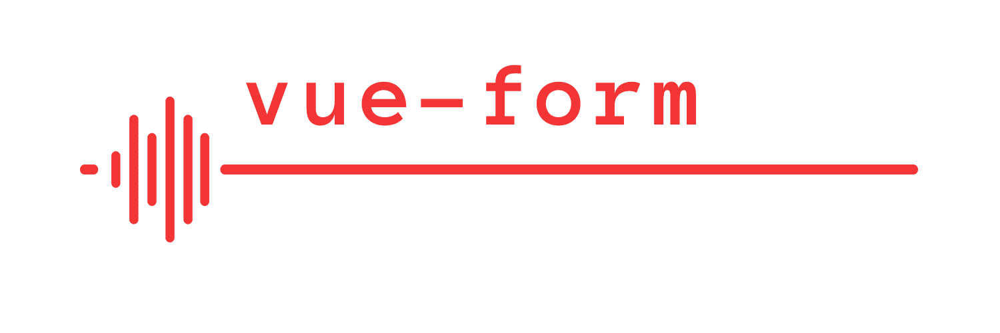

# vue-form



Form State Management for VueJS

[](https://npmjs.org/package/@detools/vue-form 'View this project on npm')
[](https://npmjs.org/package/@detools/vue-form 'View this project on npm')
[](http://opensource.org/licenses/MIT)

## Installation

```bash
npm i @detools/vue-form
```

## Usage

```js
import { Button } from 'element-ui'
import Form, { Input } from '@detools/vue-form'

export default {
  data() {
    return {
      formValues: {},
    }
  },

  methods: {
    handleSubmit(values) {
      this.formValues = values
    },
  },

  render() {
    return (
      <div>
        <h1>Basic Form</h1>
        <div class="wrapper">
          <div class="form">
            <Form reset submit="Save" labelPosition="top" handleSubmit={this.handleSubmit}>
              <Input formItem name="username" label="Username" />
            </Form>
          </div>
          <div class="values">
            <strong>Form Values</strong>
            <br />
            <br />
            <div>{JSON.stringify(this.formValues, null, 2)}</div>
          </div>
        </div>
      </div>
    )
  },
}
```

## More Examples

See source in [example/src](/example/src) folder.  
See demo at [https://detools.github.io/vue-form](https://detools.github.io/vue-form)

## Available Connected Components

- [Checkbox](/VueForm/components/ConnectedCheckbox.js)
- [CheckboxGroup](/VueForm/components/ConnectedCheckboxGroup.js)
- [DatePicker](/VueForm/components/ConnectedDatePicker.js)
- [Input](/VueForm/components/ConnectedInput.js)
- [InputNumber](/VueForm/components/ConnectedInputNumber.js)
- [Radio](/VueForm/components/ConnectedRadio.js)
- [RadioGroup](/VueForm/components/ConnectedRadioGroup.js)
- [Select](/VueForm/components/ConnectedSelect.js)
- [Slider](/VueForm/components/ConnectedSlider.js)
- [Switch](/VueForm/components/ConnectedSwitch.js)
- [TimePicker](/VueForm/components/ConnectedTimePicker.js)
- [FieldArray](/VueForm/components/ConnectedFieldArray.js)
- [Form](/VueForm/components/Form/Form.vue)

## Changelog

- [2.5.7](/CHANGELOG.md#257)
- [2.5.6](/CHANGELOG.md#256)
- [2.5.5](/CHANGELOG.md#255)
- [2.5.4](/CHANGELOG.md#254)
- [2.5.3](/CHANGELOG.md#253)
- [2.5.2](/CHANGELOG.md#252)
- [2.5.1](/CHANGELOG.md#251)
- [2.5.0](/CHANGELOG.md#250)
- [2.4.2](/CHANGELOG.md#242)
- [2.4.1](/CHANGELOG.md#241)
- [2.4.0](/CHANGELOG.md#240)
- [2.3.1](/CHANGELOG.md#231)
- [2.3.0](/CHANGELOG.md#230)
- [2.2.0](/CHANGELOG.md#220)
- [2.1.0](/CHANGELOG.md#210)
- [2.0.0](/CHANGELOG.md#200)
- [1.5.0](/CHANGELOG.md#150)
- [1.4.4](/CHANGELOG.md#144)
- [1.4.3](/CHANGELOG.md#143)
- [1.4.2](/CHANGELOG.md#142)
- [1.4.1](/CHANGELOG.md#141)
- [1.4.0](/CHANGELOG.md#140)

## Roadmap

- Add remaining components
  - `<Upload />`
  - `<Rate />`
- Add validation examples
  - [Field level sync/async validation](https://detools.github.io/vue-form/#/inline-validators-form)
  - [Form level sync validation](https://detools.github.io/vue-form/#/sync-validation-form)
